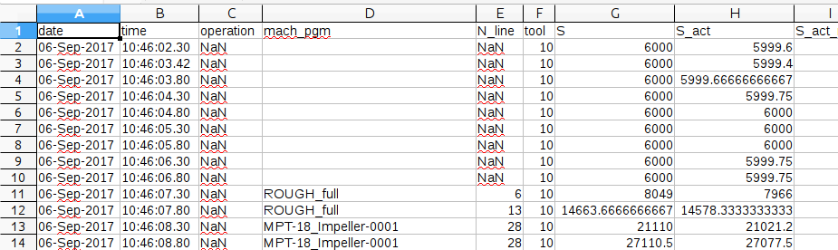

# showcase.IDS.ZeroDefects
IDS Showcase. Improving manufacturing processes by data sharing

Most manufacturing plans incorporate two types of machines in the production chain:

+ Milling machines, producing objects by means of using rotary cutters to remove material from a workpiece of raw material
+ Coordinate-Measuring Machines (CMM), for measuring the physical geometrical characteristics of manufactured objects in order to detect defects, etc.

Each machine could improve its configuration and maintenance by means of using data produced by the other machines, bringing overall a better service to its customer (the Factory)


# FIWARE Milling Machine adaptor

This script will translate data output from a Milling Machine (sensors, status...) to NGSIv2. These data is generated by a Milling Machine in a CSV format a a set of time stamps, and each time stamp providing information of the different sensors from the machine:



Each CSV file provided by the MM represents the building of an specific piece/part. The script will take this input using a configuration file. The configuration file marks which columns will be translated, the data type and the attribute name that will be used in NGSI.


```
{
  "config": [{
     "colunm_name": "spindle_brg_temp",
      "type": "Float",
      "attribute_name" : "spindle_brg_temp"
    },
    {
     "colunm_name": "module_8_state",
      "type": "Integer",
      "attribute_name": "module_8_state"
    },
    {
     "colunm_name": "tool",
      "type": "Integer",
      "attribute_name": "tool_to"
    }
  ]
}

```

You can send any column just configuring this file with the name of the column, the data type, and the name you want to use for the NGSI representation:
 * "column_name" is a name of a column in the output file from the MM
 * "type" is the type, it will be used for NGSI type
 * "attribute_name" is the name to be used for NGSI. Usually, this name could be the same as column_name, but you could use a different one for having any kind of representation about your NGSI data model. 

According to this configuration: 

 * A device will be created with tree attributes.
 * A CSV file will be parsed to extract columns spindle_brg_temp, module_8_state and tool
 * Each row, representing a time stamp, will be send to Orion about these columns. Translated into a JSON NGSIv2


## Generated data models

### JSON example about entity creation

This script will create an entity representing a Milling Machine with different sensors, according to previous configuration.

Creating de entity Milling Machine

```
{   
    "spindle_brg_temp": {
        "type": "Float", 
        "value": 0
    }, 
    "module_8_state": {
        "type": "Integer", 
        "value": 0
    }, 
    "type": "FirstMachineDevice", 
    "id": "MillingMachine", 
    "tool_to": {
        "type": "Integer", 
        "value": 0
    }
}
```

For each row of the CSV file generate by the Milling Machine, attributes specified in the configuration file will be send as NGSI attributes:

Example of a JSON generated for a meassuremnt (CSV row) and attributes:

```
{   
    "TimeInstant": {
        "type": "ISO8601",
        "value": "2017-09-06T13:38:00.160000Z"
    },
    "spindle_brg_temp": {
        "type": "Float", 
        "value": 34.275
    },
    "module_8_state": {
        "type": "Integer", 
        "value": 2
    }, 
    "tool_to": {
        "type": "Integer", 
        "value": 12
    }, 
    "currentPart": "MM_data_output/Transfer_data_MPT_18_Impeller_0002_ref_APS_ok.csv"
}

```

currentPart attribute represents the name of the part/piece that is been generated by the Milling Machine


## How to run it


The script has been developed with Python, so, you need Python installed in your system. Currently tested with python 2.7

The default ORION broker URL will be http://localhost:1026 you can use the environmental variable ORION_URL to overwrite this value:

```
$> export ORION_URL=http://127.0.0.1:1026

$> ./script.py input_file.csv 

```

Parameters:

 * input_file.csv is a data file generated by a Milling MAchine
 


## How to run it with Docker

You can find the docker image from [here](docker.io/jgato/fiware-milling)


Basic running configuration:

```
$> docker run -e ORION_URL=http://IP:PORT  -v `pwd`/MM_data_output/Transfer_data_MPT_18_Impeller_0001_ref_APS_nok.csv:/usr/src/app/config/input.csv:ro -it jgato/fiware-milling

```
 * ORION_URL is an optional parameter, if not set, it will use ORION default url in http://localhost:11026
 * By default you have to share input.csv file into /usr/src/app/config/input.csv

Other options:

Instead of sharing a CSV file you can use any included inside the container, that you can check in this repository in the MM_data_output directory:

```
$> docker run -e ORION_URL=http://130.206.116.137:11026  -it jgato/fiware-milling script.py MM_data_output/Transfer_data_MPT_18_Impeller_0001_ref_APS_nok.csv

```

Also you can enable the time simulation, that will send measurements of each row, considering the difference of time between rows: 
**not implemented yet**

```
$> docker run -e ORION_URL=http://130.206.116.137:11026  -it jgato/fiware-milling script.py MM_data_output/Transfer_data_MPT_18_Impeller_0001_ref_APS_nok.csv --enable-time-simulator

```
