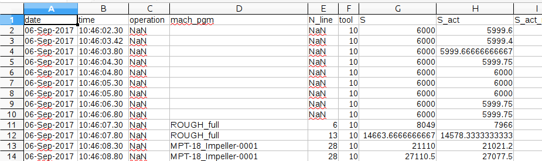

# FIWARE Milling Machine adaptor

This script will translate data output from a Milling Machine (sensors, status...) to NGSIv2. These data is generated by a Milling Machine in a CSV format a a set of time stamps, and each time stamp providing information of the different sensors from the machine:



The script will take this input using a configuration file. This configuration file marks which columns will be translated, the data type and the attribute name that will be used in NGSI.

This configuration file will be also used to create a device in NGSI format. The device will be configured about the attributes specified in this configuration file.


```
{
  "config": [{
     "colunm_name": "spindle_brg_temp",
      "type": "Float",
      "attribute_name" : "spindle_brg_temp"
    },
    {
     "colunm_name": "module_8_state",
      "type": "Integer",
      "attribute_name": "module_8_state"
    },
    {
     "colunm_name": "tool",
      "type": "Integer",
      "attribute_name": "tool_to"
    }
  ]
}

```

You can send any column just configuring this file with the name of the column, the data type, and the name you want to use for the NGSI representation:
 * "column_name" is a name of a column in the output file from the MM
 * "type" is the type, it will be used for NGSI type
 * "attribute_name" is the name to be used for NGSI. Usually, this name could be the same as column_name, but you could use a different one for having any kind of representation about your NGSI data model. 

According to this configuration: 

 * A device will be created with tree attributes.
 * A CSV file will be parsed to extract columns spindle_brg_temp, module_8_state and tool
 * Each row, representing a time stamp, will be send to Orion about these columns. Translated into a JSON NGSIv2

Example of JSON generated:

```
{
    "spindle_brg_temp": {
        "type": "Float", 
        "value": 34.275
    }, 
    "module_8_state": {
        "type": "Integer", 
        "value": 2
    }, 
    "tool_to": {
        "type": "Integer", 
        "value": 12
    }, 
    "currentPart": "MM_data_output/Transfer_data_MPT_18_Impeller_0002_ref_APS_ok.csv"
}

```

## How to run it

The script has been developed with Python, so, you need Python installed in your system.

./script.py device_name input_file.csv 
 * device_name to be created and representing the Milling Machine providing the data.
 * input_file.csv is a data file generated by a Milling MAchine
 
## How to run it with Docker

